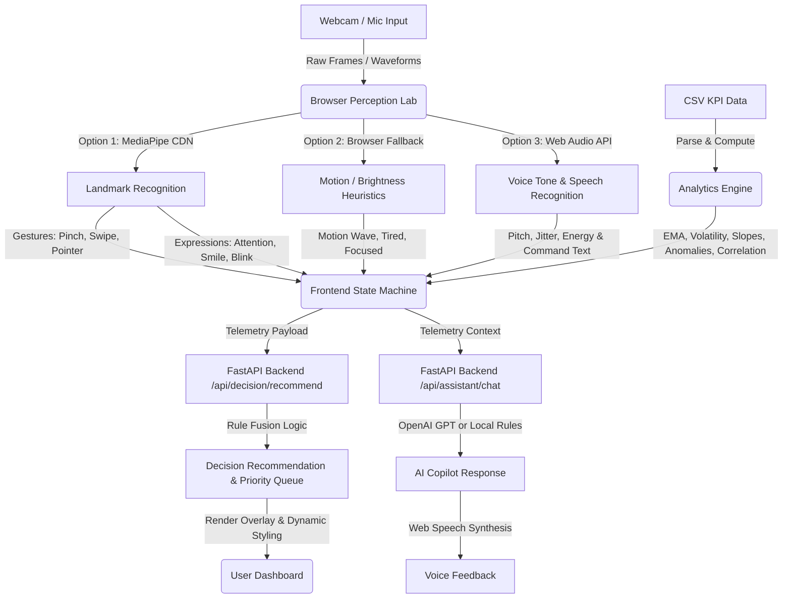

# NeuroSync AI: Multimodal Intelligence Dashboard & Architecture Analysis

NeuroSync AI is an immersive, multimodal dashboard designed to fuse live sensory perception (vision, emotion, gesture, voice, audio) with backend predictive analytics (CSV analytics, forecasting models) and decision intelligence in real time. 

---

## 📂 Core Project Directory Structure

Here is how the project components are organized across the workspace:

```text
NeuroSync - AI/
├── Ai_models/               # Python ML models & baseline scripts
│   ├── __init__.py          # Initialization script
│   ├── analytics_engine.py  # Advanced forecasting, anomaly detection, risk & confidence calculations
│   ├── baseline_models.py   # Code for loading CSV data, training Linear Regression and Random Forest models
│   ├── decision_fusion.py   # Complex signal fusion logic combining gestures, facial expressions, and voice metrics
│   ├── lstm_placeholder.py  # A moving-average fallback placeholder simulating an LSTM sequence forecast
│   ├── tone_analyzer.py     # Rules-based analysis of voice pitch, jitter, and energy thresholds
│   └── trained/             # Directory where trained .joblib models are exported
│
├── Assets/                  # Visual branding assets and logos
│
├── Backend/                 # FastAPI Backend API Service
│   └── app/
│       ├── main.py          # FastAPI application, route declarations, CORS, and static file mapping
│       ├── config.py        # Settings management via Pydantic Settings (.env, OpenAI keys, model configs)
│       ├── schemas.py       # Pydantic schema validation for requests and responses
│       └── services/
│           ├── analytics.py # Statistical calculation engine (EMA, slopes, Z-score anomalies, risk scores)
│           ├── assistant.py # AI Chat Service (wires to OpenAI ChatCompletion or local fallback rule engine)
│           ├── decision.py  # State-machine rule parser fusing sensor telemetry into action recommendations
│           └── models.py    # Health & status checks for local, browser-based, and trained ML models
│
├── Data/                    # Analytics datasets
│   └── sample_productivity.csv # Starter CSV data (date, focus_score, productivity_score, emotion_score, tasks)
│
├── Docker/                  # Deployment & containerization config
│   ├── Dockerfile           # Standard multi-stage container deployment definition
│   └── docker-compose.yml   # Multi-service configuration block
│
├── Docs/                    # Technical documentation and system overviews
│   └── backend-overview.md  # Quick documentation of routes and scripts
│
├── Frontend/                # User Interface Assets (served directly by FastAPI or local static servers)
│   ├── index.html           # Structured HTML dashboard mockup containing layout cards and canvas overlays
│   ├── styles.css           # Vanilla CSS layout styling with glassmorphism, responsive grids, and 6 active themes
│   └── app.js               # Frontend controller managing local state, MediaPipe loops, Web Speech, and canvas loops
│
├── Scripts/                 # Automation scripts
│   ├── start_backend.ps1    # PowerShell helper script to run the local FastAPI uvicorn server
│   └── train_all_models.py  # Script for training and saving scikit-learn models from CSV data
│
├── Procfile                 # Deployment instructions for PaaS (e.g. Heroku, Render)
├── requirements.txt         # Core workspace Python package definitions
└── vercel.json              # Config parameters routing public HTTP requests through Vercel Python serverless API
```

---

## ⚙️ System Components & Telemetry Flow

The system runs as a hybrid client-server application. It is designed to work in two modes: **Live Models mode** (where browser APIs, MediaPipe web models, and local FastAPI servers are connected) and **Hybrid Demo mode** (which simulates signals when resources like cameras or backend services are offline).



---

## 📂 Multimodal Input Streams (Perception Lab)

### 1. Vision & Gesture Tracking
* **MediaPipe Hands:** Analyzes 21 points on up to two hands. Heuristics are computed in [app.js](file:///c:/Users/parth/OneDrive/Desktop/Project%20and%20work/NeuroSync%20-%20AI/Frontend/app.js) to recognize gestures:
  * **Pinch Select:** Distance between thumb-tip and index-tip is low (`< 0.055`).
  * **Open Palm:** Multiple fingers extended (`>= 4`).
  * **Swipe Left / Right:** Open palm moves along the X-axis rapidly (`|deltaX| > 0.1` within `500ms`).
  * **Fist / Hold:** Compact hand shape close to the wrist.
  * **Pointer:** Default single-finger extension.
* **Camera Fallback Heuristic:** If MediaPipe CDN scripts fail to load or the CPU struggles, a low-latency loop runs. It compares downsampled frames (`96x54`) to compute frame-to-frame pixel differences:
  * **Motion score** is computed based on brightness changes.
  * **Warm pixel count** determines skin-warmth heuristics.
  * Maps output to fallback gestures (`Motion Wave`, `Micro Movement`, `Open Presence`).

### 2. Emotion & Attention Assessment
* **FaceMesh & Expressions:** Evaluates distances between mouth boundaries, eyes, and eyebrow elevation:
  * **Surprised:** Wide open mouth and high eye openness.
  * **Positive:** High ratio of mouth width to mouth height (smile gesture).
  * **Tired:** Eye openness drops below a low threshold (`< 0.012`). Attention score drops by 18%.
  * **Focused:** Eye openness is moderately low (`< 0.019`), representing squinted attention.
  * **Attention heuristic:** Blends eye openness and eyebrow lift scales to output a percentage score (`40%` to `98%`).
* **Camera Fallback Emotion:** Low brightness maps to `Tired`, high warmth maps to `Positive`, high movement maps to `Engaged`, otherwise stays `Focused`.

### 3. Voice & Command Controls
* **Web Speech API:** Harnesses standard browser speech recognition:
  * **Trigger Commands:** Triggers navigation (`analytics` scrolls page), config changes (`focus mode`), starts components (`camera` or `vision`), and queries state summaries (`summary` command triggers voice narrations).
  * **Mute Option:** Voice feedback can be silenced with the keyword `mute`.
  * **Speech Synthesis:** Uses browser voice engines to reply out loud.

### 4. Audio Waveform & Tone Analysis
* **Web Audio API:** Requests microphone permissions and mounts an analyzer (`FFT size 1024`).
  * Calculates **Root Mean Square (RMS)** of ambient audio samples to draw a responsive graphical oscilloscope canvas and display a mic volume progress bar (`0%` to `100%`).
* **Voice Tone Analyzer Engine:** Extracted voice telemetry (Pitch, Jitter, and Energy) is processed in [tone_analyzer.py](file:///c:/Users/parth/OneDrive/Desktop/Project%20and%20work/NeuroSync%20-%20AI/Ai_models/tone_analyzer.py) to assess stress and arousal states:
  * **Silent:** Triggered when normalized volume energy is `< 0.05`.
  * **Excited:** High pitch (`> 200 Hz`) and high frequency stability variance (`jitter > 0.08`). Arousal = `0.85`.
  * **Stressed:** High pitch (`> 200 Hz`), low variance, and high vocal volume (`energy > 0.35`). Arousal = `0.78`.
  * **Alert:** High pitch (`> 200 Hz`) with moderate energy and low jitter. Arousal = `0.60`.
  * **Expressive:** Standard pitch (`80-200 Hz`) and high variance (`jitter > 0.08`). Arousal = `0.65`.
  * **Assertive:** Standard pitch (`80-200 Hz`) and high energy (`energy > 0.35`). Arousal = `0.70`.
  * **Calm:** Standard pitch (`80-200 Hz`) with low jitter and stable volume. Arousal = `0.35`.
  * **Tired:** Low pitch (`< 80 Hz`) and low vocal energy (`energy < 0.15`). Arousal = `0.15`.
  * **Steady:** Low pitch (`< 80 Hz`) with sustained energy. Arousal = `0.30`.

---

## 📈 Analytics & Forecasting Engine

The dashboard processes CSV spreadsheets (either dropped by the user or pre-loaded via the sample dataset) using a multi-model forecasting engine. These algorithms run in parallel on both the frontend ([app.js](file:///c:/Users/parth/OneDrive/Desktop/Project%20and%20work/NeuroSync%20-%20AI/Frontend/app.js)) and backend ([analytics_engine.py](file:///c:/Users/parth/OneDrive/Desktop/Project%20and%20work/NeuroSync%20-%20AI/Ai_models/analytics_engine.py)):

1. **Weighted Ensemble Forecast:** Blends multiple forecasting lines together:
   * **Linear Trend (28% weight):** Extrapolates based on calculated slope (mean square regression slope) multiplied by $1.25$ offsets.
     $$\text{Linear Estimate} = \text{Average Productivity} + (\text{Slope} \times 1.25)$$
   * **Exponential Smoothing / EMA (34% weight):** A smoothing curve ($\alpha = 0.42$) combined with a $35\%$ trend momentum vector.
     $$\text{EMA}_{t} = 0.42 \times \text{Productivity}_{t} + 0.58 \times \text{EMA}_{t-1}$$
     $$\text{EMA Forecast} = \text{EMA}_{n} + 0.35 \times (\text{Productivity}_{n} - \text{EMA}_{n})$$
   * **Momentum Regression (24% weight):** Calculates slope on the most recent 4 data points and extrapolates.
   * **Seasonal Naive Baseline (14% weight):** Blends the previous day's value ($62\%$) with the value from 7 days ago ($38\%$) to capture weekly cycles.
     $$\text{Seasonal Forecast} = 0.62 \times \text{Productivity}_{n} + 0.38 \times \text{Productivity}_{n-7}$$
   * **Final Ensemble Forecast:**
     $$\text{Predicted Next} = 0.28 \times \text{Linear} + 0.34 \times \text{EMA} + 0.24 \times \text{Momentum} + 0.14 \times \text{Seasonal}$$

2. **Z-Score Anomaly Detection:** Flags data points where the Z-score is $\ge 1.65$ (representing a $90\%$ confidence interval) and the absolute deviation from the average is $\ge 7$:
   $$Z = \frac{|x_i - \mu|}{\sigma} \ge 1.65 \quad \text{and} \quad |x_i - \mu| \ge 7$$

3. **Focus-Productivity Correlation:** Calculates Pearson's correlation coefficient ($r$) between the focus series and productivity series. Focus-productivity fit is calculated using a sigmoid function:
   $$\text{Fit} = \text{sigmoid}(r \times 2.4)$$

4. **Risk Score ($0$ to $100$):** Combines volatility (standard deviation), anomalies, trend slope, and low-focus penalties:
   $$\text{Risk} = \text{volatility} \times 3.1 + \text{anomalies} \times 8.5 - \text{slope} \times 2.2 + \max(0, 70 - \text{average\_focus}) \times 0.35$$

5. **Model Confidence ($42\%$ to $96\%$):** Drops with high volatility or anomalies, and increases as more records (up to 30) are fed to the engine:
   $$\text{Confidence} = 92.0 - \text{volatility} \times 2.4 - \text{anomalies} \times 5.0 + \min(n_{\text{rows}}, 30) \times 0.45$$

6. **Model Signal Quality:**
   * **High:** Confidence $\ge 78\%$
   * **Medium:** Confidence $\ge 60\%$
   * **Low:** Confidence $< 60\%$

---

## ⚡ Decision Intelligence & Signal Fusion

The system contains a decision service ([decision_fusion.py](file:///c:/Users/parth/OneDrive/Desktop/Project%20and%20work/NeuroSync%20-%20AI/Ai_models/decision_fusion.py)) that fuses all metrics and perception signals into a single recommended action. It assigns relative weights dynamically:
* **Gesture Weight:** $28\%$ if active, $16\%$ if idle.
* **Emotion Weight:** $28\%$ if expressive, $20\%$ if neutral.
* **Voice Weight:** $24\%$ if a voice command is active, $16\%$ if standby.
* **Analytics Weight:** $32\%$ if CSV data is loaded, $18\%$ if empty.

### Decision Actions & Fusion Logic:
* **Pinch Select** $\rightarrow$ *Lock onto active workspace selection* (Intent Capture mode).
* **Swipe Left/Right** $\rightarrow$ *Navigate insight carousel* (Navigation mode).
* **Motion Fallbacks** $\rightarrow$ *Maintain live perception tracking* (Live Tracking mode).
* **Critical Stress (Expression Stressed + Voice Stressed)** $\rightarrow$ *Critical stress intervention triggered* (Critical Stress Intervention mode). Triggers deep breathing sequences and switches interface theme to Calm Lavender.
* **Tired Expression + Tired Voice** $\rightarrow$ *Mandatory recovery break recommended* (Mandatory Recovery mode).
* **Tired Expression or Tired Voice** $\rightarrow$ *Trigger recovery recommendation* (Recovery mode).
* **Focused Expression + Focus > 70%** $\rightarrow$ *Preserve deep-work flow* (Focus Preservation mode).
* **Engaged Expression** $\rightarrow$ *Amplify active workspace support* (Active Support mode).
* **CSV Trend "Cooling"** $\rightarrow$ *Intervene before productivity softens* (Stabilization mode).
* **Risk Score >= 58%** $\rightarrow$ *Stabilize high-risk work session* (Risk Control mode).

### Dynamic Confidence Dampening:
To account for environmental noise, the decision confidence is dynamically dampened on the backend:
* **Audio Noise Floor > 0.16:** Reduces decision confidence by $15\%$.
* **Camera Fallback Active:** Reduces decision confidence by $10\%$.
* **No Active Perception (Idle + Neutral):** Reduces decision confidence by $5\%$.

---

## 💬 AI Copilot Assistant

* **OpenAI Assistant API Hook:** Wires directly to FastAPI. If an `OPENAI_API_KEY` is provided in environment variables, the backend parses chat prompts and injects the live context dictionary (`detection`, `analytics`, `decision`). It formats the system instruction:
  > You are NeuroSync AI, a multimodal assistant for gesture, voice, emotion, analytics, and decision intelligence. Keep responses concise, practical, and grounded in the provided context.
* **Local Fallback Engine:** If no OpenAI key is set, the system falls back to a rules engine. It uses key phrase matching (e.g., `gesture`, `forecast`, `decision`, `insight`) to reply with structured state readouts.

---

## 🎨 Themes & Customization

The dashboard includes a CSS stylesheet (`styles.css`) that leverages CSS variables (`--bg`, `--accent`, `--panel-bg`) to define six distinct styling themes:
1. **Neon (Default):** Vibrant cyberpunk grid with neon cyan and magenta accents.
2. **Aurora:** Calm organic theme with northern-lights green and dark-forest greens.
3. **Ember:** High-contrast volcanic layout with dark charcoal and glowing orange details.
4. **Cobalt:** Industrial scientific layout with slate blues and electric blue borders.
5. **Focus:** Clean monochrome dark theme optimized to eliminate distractions.
6. **Calm:** Gentle lavender-gray styling with muted purple tones.

---

## ⚙️ How to Run the Project Locally

### 1. Prerequisites
* **Python:** version `3.9` or newer installed.
* **Web Browser:** A modern browser with webcam and microphone support (Chrome or Edge recommended for speech APIs).
* **Internet Connection:** Needed to fetch MediaPipe models from the CDN.

### 2. Quick Local Setup
Clone the repository and install all backend requirements:
```powershell
pip install -r requirements.txt
```

### 3. Start the Backend API
Start the FastAPI server via Uvicorn:
```powershell
python -m uvicorn app.main:app --app-dir Backend --host 127.0.0.1 --port 8000
```
Open your browser to:
```text
http://127.0.0.1:8000
```
> [!IMPORTANT]
> Make sure to load the project from `http://127.0.0.1:8000` rather than opening `index.html` as a file; browser camera/microphone APIs require local network serving or HTTPS to run.

### 4. Optional Configurations (OpenAI Integration)
Create a `.env` file in the root workspace or set environment variables:
```powershell
$env:OPENAI_API_KEY="your-openai-api-key-here"
$env:OPENAI_MODEL="gpt-4o-mini"
```
If these variables are missing, the system will gracefully use the local rules fallback engine.

---

## 🐳 Docker Deployment & Containment

A fully-configured Docker Compose file is available to launch the service in isolated containers:
```powershell
cd Docker
docker compose up --build
```
This binds to `http://127.0.0.1:8000` automatically.

---

## 🚀 Vercel Production Deployment

The project is pre-configured with `vercel.json` and `api/index.py` for cloud-based serverless deployment.

### 1. GitHub Integration (Recommended)
1. Push your workspace repository to GitHub.
2. Open Vercel and import your repository.
3. Set Framework Preset as **Other**.
4. (Optional) Define your environment variable overrides (`OPENAI_API_KEY`).
5. Click **Deploy**.

### 2. Vercel CLI Deployment
Deploy a preview environment or production directly from your local terminal:
```powershell
# Install Vercel CLI globally
npm install -g vercel

# Authenticate
vercel login

# Trigger Preview Build
vercel

# Deploy to Production
vercel --prod
```

---

## 📊 Summary of Main API Endpoints

FastAPI exposes the following JSON endpoints in [main.py](file:///c:/Users/parth/OneDrive/Desktop/Project%20and%20work/NeuroSync%20-%20AI/Backend/app/main.py):

| Method | Endpoint | Description |
| :--- | :--- | :--- |
| **GET** | `/api/health` | Returns API status, app version, OpenAI capability, and model statuses. |
| **GET** | `/api/models/status` | Queries the AI model registry and checks which models are loaded. |
| **POST** | `/api/assistant/chat` | Receives messages with system context; runs OpenAI completion or falls back to local rules. |
| **POST** | `/api/analytics/analyze` | Receives JSON rows of productivity telemetry; returns forecast calculations and observations. |
| **POST** | `/api/decision/recommend` | Runs the signal-fusion engine on combined inputs, returning a decision and action queue. |
| **GET** | `/` | Serves the frontend entry point `index.html`. |
| **GET** | `/styles.css` | Serves the layout styling. |
| **GET** | `/app.js` | Serves the main JavaScript code. |

---

## 🔍 Validation Commands

Verify your syntax and execution logic with standard tests:
```powershell
# Compile check python packages
python -m compileall Backend\app

# Check Javascript syntax errors
node --check Frontend\app.js

# Health check via HTTP request
Invoke-WebRequest -UseBasicParsing http://127.0.0.1:8000/api/health
```
